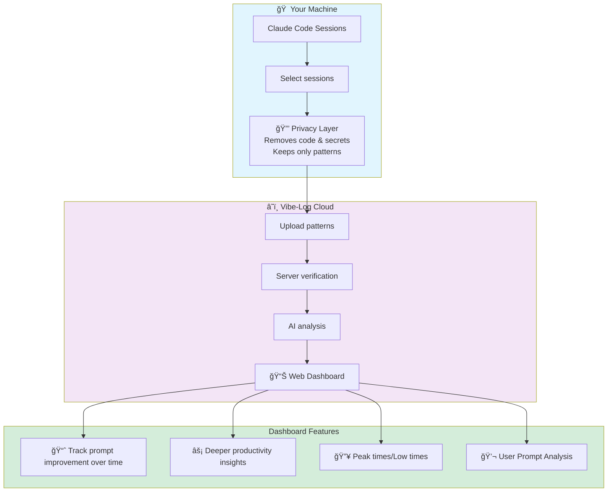

<div align="center">

 


<p></p>
<h3>Open-source CLI for analyzing Claude Code sessions locally and generating productivity reports</h3>
<p></p>

<a href="https://vibe-log.dev"></a>
<a href="https://www.npmjs.com/package/vibe-log-cli"></a>
<a href="https://opensource.org/licenses/MIT"></a>
<a href="https://nodejs.org"></a>

<a href="https://github.com/vibe-log/vibe-log-cli/actions/workflows/tests.yml"></a>
<a href="https://github.com/vibe-log/vibe-log-cli/actions/workflows/npm-publish.yml"></a>
<a href="https://github.com/vibe-log/vibe-log-cli/actions/workflows/build-verification.yml"></a>

<a href="SECURITY.md"></a>
<a href="https://github.com/vibe-log/vibe-log-cli?tab=readme-ov-file#-privacy--security"></a>

<a href="CONTRIBUTING.md"></a>
<a href="https://x.com/Vibe_Log/"></a>
<a href="https://github.com/vibe-log/vibe-log-cli"></a>  
 
</p>
</p>

[Website](https://vibe-log.dev) • [Report Bug](https://github.com/vibe-log/vibe-log-cli/issues) • [Request Feature](https://github.com/vibe-log/vibe-log-cli/issues)
</div>


## What is Vibe-Log?

Vibe-log-cli is an open-source command-line tool that analyzes your Claude Code sessions to extract productivity insights and generate reports. All analyses can run completely locally on your machine using Claude Code's capabilities. It also encompasses a statusline that help you get more from your sessions.  

## Getting Started fast
Just run: 
```bash
npx vibe-log-cli@latest
```
 

## Main features 
### 1. 📋 Today's standup 
New: Be prepared in 2-3 minutes for your daily standup meeting! 


### 2. 📊 Claude Code Productivity Report Generation (Local) 
Generate comprehensive productivity reports using Claude Code's sub-agents to analyze your sessions in parallel. No data leaves your machine.
See example of locally generated report here: https://vibe-log.dev/example-daily-report
 

### 3. 🧠 Claude Code Co-pilot Statusline 
Strategic product advisor in Claude Code. Your prompts are analyzed locally (via CC) to provide actionable guidance that pushes you to ship faster. Feedback appears in your Claude Code status line with concrete next steps.


## Updates 

### What's New in v0.7.x
#### Today's Standup ✨
Get a personalized standup summary of your recent claude coding activity right from your terminal. Runs 100% locally using your own Claude Code installation 
The standup feature analyzes your recent sessions and generates a concise summary of:
* What you worked on
* Key accomplishments
* Next steps

#### Improved Onboarding Experience 🚀
Getting started with vibe-log is now smoother than ever:
Better first-run setup flow
Helpful prompts to guide you through configuration
Improved error messages when things go wrong

#### Improved Time Calculation ⏱️
More accurate session duration tracking with better handling of:
Massive sessions: Sessions with 10,000+ messages no longer cause performance issues
Smart truncation: Large sessions are intelligently truncated while preserving time data
Consistent timestamps: Better parsing and validation of session timing information
Edge case handling: Fixed issues with sessions that had missing or invalid timestamps


## 💬 More about Claude Status Line - Strategic Co-pilot / Advisor (Local)

**🔒 Installation Safety**: Automatically backs up your existing status line configuration. Uninstalling instantly restores your original setup - zero risk to your Claude Code configuration.


### Why Use Status Line?

- **🚀 Ship Faster**: Get pushed to deliver
- **🎯 Stay Focused**: Remembers your original mission and keeps you on track and forward ⏩︎
- **⚡ Concrete Actions**: Specific next steps like:
- **📈 Strategic Thinking**: Considers edge cases, user experience, and scaling at the right time
- **📊 Token Usage Display**: Integrates with ccusage to show real-time token metrics
- **↩️ Easy Restore**: Your original status line is backed up and can be restored anytime
## Architecture
### How Status Line Works
1. Intercepts prompts submitted in Claude Code
1. Analyzes via the local Claude Code latest prompt with relevant session context.
4. Provides strategic guidance and pushes you to ship
5. Displays actionable feedback in the Claude Code status line

In more details:
```mermaid
flowchart LR
    subgraph Input ["✳️ In Claude Code"]
        User([👤 You type a<br/>prompt]) --> Submit[Press Enter to<br/>submit prompt]
        Submit --> Hook[🪝 UserPromptSubmit<br/>hook triggers]
    end

    subgraph Analysis ["🧠 Local Prompt Analysis via Claude Code SDK"]
        Hook --> CLI[Vibe-log CLI<br/>receives prompt]
        CLI --> Check{Is new chat?}
        Check -->|No| Context[📝 Include previous<br/>conversation]
        Check -->|Yes| Direct[💭 Analyze prompt<br/>standalone]
        
        subgraph Personality ["🎭 Infuse Coach Personality"]
            Gordon[🧑‍🍳 Gordon<br/>Tough love]
            Vibe[💜 Vibe-log<br/>Encouraging]
            Custom[✨ Custom<br/>Your style]
        end
        
        Context --> SDK[Claude SDK<br/>analyzes prompt quality]
        Direct --> SDK
        Personality -.-> SDK
        SDK --> Score[📊 Generate score<br/>& suggestion]
    end

    subgraph Display ["💬 Status Line Feedback"]
        Score --> Save[💾 Save to<br/>~/.vibe-log/analysis]
        Save --> Status[Status bar<br/>reads result]
        Status --> Show[🟢 85/100<br/>✨ Gordon says:<br/>Add more context chef!]
    end

    Show --> Improve([📈 Better prompts<br/>Better results])
  ```

### Coach Personalities
- **Gordon** - Sharp, pushy, business-focused. Creates urgency: "Ship by FRIDAY or you're fired!"
- **Vibe-Log** - Supportive but pushy senior dev. Helps you ship: "MVP checklist: Auth works ✓ | Ship it!"
- **Custom** - User-defined personality with strategic focus

### Example Output
 

### Setup
1. Run `npx vibe-log-cli`
2. Select "Configure prompt coach status line"
3. Choose coach personality
4. (Optional) Enable ccusage token metrics display
5. Prompts will be analyzed locally in Claude Code

**Note**: Installation automatically backs up your current status line (if any). When you uninstall vibe-log, your original configuration is instantly restored.

## Local Report Generation Works

Generate comprehensive productivity reports using Claude Code's sub-agents to analyze your sessions in parallel. No data leaves your machine.
- Select timefrema
- Select projects
  
```mermaid
flowchart TD
    Start([📝 Claude Code Sessions]) --> Select[vibe-log-cli select time frame and projects]
    Select --> Extract[Extracts & prepares session data]
    Extract --> Launch[Launches Claude with instructions]
    Launch --> Parallel{Parallel sub-agents<br/> session analysis}
    Parallel --> Gather[Gathers results &<br/>Generates report]
    Gather --> Output[📊 HTML Report in current folder]    
    style Start fill:#e1f5fe
    style Output fill:#d4edda
```
## Example of Local Report Output


## ☁️ Cloud Sync (Optional)

Optionally sync your sanitized session data to the vibe-log dashboard for advanced analytics and tracking over time.

### Features
- **🎁 Free Forever**: Up to 1,000 session analyses per month
- **📈 Track Over Time**: Monitor your prompt quality and productivity trends
- **🔄 Auto-sync**: Configure hooks for automatic background sync
- **🔒 Privacy First**: All code removed before upload, only patterns synced
- **📊 Web Dashboard**: Learn and improve your AI coding sessions.

### How It Works


## Auto-Sync 
### What is Auto-Sync
Claude Code Hooks allow Vibe-Log to automatically sync your Claude Code sessions.

What are Claude Code Hooks?

  • Small commands that run at specific moments in Claude Code
  
  • They work silently in the background (you won't notice them)

  
Which hooks do we use?

  📍 SessionStart - Syncs previous sessions when you start/resume work
     (Triggers: startup, resume, clear commands)
     
  📦 PreCompact - Syncs full session before context compression
     (Triggers: manual or automatic context cleanup)

     
Why we recommend both:

  ✓ SessionStart ensures nothing is lost between sessions
  
  ✓ PreCompact syncs everything before Claude compresses context
    
### Setup Auto-sync
1. Run `npx vibe-log-cli`
2. Authenticate with your Github account
3. Enable auto-sync via CLI menu

## Supported Coding Engines 

Currently supported:
- ✅ Claude Code

Future:
- 🔜 Cursor
- 🔜 VS Code

🌍 Cross-Platform - Runs on macOS, Windows, Linux, and any environment with Node.js


## 🔒 Privacy & Security

<div align="center">
<a href="https://github.com/vibe-log/vibe-log-cli/actions/workflows/npm-publish.yml"></a>
<a href="https://www.npmjs.com/package/vibe-log-cli"></a>
<a href="#verify-our-package"></a>
<a href="https://github.com/vibe-log/vibe-log-cli"></a>
</div>

<br>

**This package is built with complete transparency:**

- ✅ **Source Code**: Fully open source at [github.com/vibe-log/vibe-log-cli](https://github.com/vibe-log/vibe-log-cli)
- ✅ **Not Minified**: Published code is readable and verifiable
- ✅ **Source Maps**: Included for debugging and verification
- ✅ **Automated Builds**: All releases via GitHub Actions (no manual publishing)
- ✅ **npm Provenance**: Every package includes build attestation
- ✅ **Checksums**: SHA256 hashes for integrity verification

### Verify Our Package

```bash
# Download and inspect the package
npm pack vibe-log-cli@latest
tar -xzf vibe-log-cli-*.tgz
head -100 package/dist/index.js  # Verify it's readable

# Check checksums
cd package/dist && sha256sum -c checksums.sha256
```

### Privacy
- **Context-Preserving Sanitization**: Messages are sanitized to remove sensitive data while preserving context
- **What gets redacted/removed**:
  - Code blocks → `[CODE_BLOCK_1: javascript]`
  - API keys/tokens → `[CREDENTIAL_1]`
  - File paths → `[PATH_1]`
  - URLs → `[DATABASE_URL]`, `[API_URL]`
  - Emails → `[EMAIL_1]`
  - Environment variables → `[ENV_VAR_1]`
  - Also Removed: Images/Binary files 
- **What's preserved**: Conversation flow, questions, explanations
- **Transparent**: Preview sanitized data with the interactive prompt
- **Open source**: Review our sanitization at [src/lib/message-sanitizer-v2.ts](src/lib/message-sanitizer-v2.ts)

## Troubleshooting

### Authentication Issues
Try the following: 
- Log out from the CLI
- Clear cookies
- Re-authenticate via the CLI 

### No Sessions Found
- Make sure Claude Code is installed
- Check that you've used Claude Code recently

### Sessions Stuck in Analyzing
- Please open a Github issue.


### Debug Mode
```bash
# Enable debug logging
VIBELOG_DEBUG=1 npx vibe-log-cli send
```

## Contributing

We love your input! We want to make contributing to Vibe-Log CLI as easy and transparent as possible. Please see our [Contributing Guide](CONTRIBUTING.md) for details.

```bash
# Clone the repository
git clone https://github.com/vibe-log/vibe-log-cli.git
cd vibe-log-cli

# Install dependencies
npm install

# Run tests
npm test

# Build the project
npm run build
```

Check out our [open issues](https://github.com/vibe-log/vibe-log-cli/issues) for a list of proposed features and known issues.

## Community

- **GitHub**: Star us on [GitHub](https://github.com/vibe-log/vibe-log-cli)
- **Issues**: Report bugs and request features in [GitHub Issues](https://github.com/vibe-log/vibe-log-cli/issues)
- **Website**: Visit [vibe-log.dev](https://vibe-log.dev)

## Support

Need help? Here are some ways to get support:
- 🐛 Report bugs in [GitHub Issues](https://github.com/vibe-log/vibe-log-cli/issues)
- 📧 Email us at support@vibe-log.dev

## License

MIT © Vibe-Log - see the [LICENSE](LICENSE) file for details.

## Acknowledgments

Built with love by the Vibe-Log team [@mickmicksh](https://github.com/mickmicksh), [@dannyshmueli](https://github.com/dannyshmueli)

Special thanks to [ccusage](https://www.npmjs.com/package/ccusage) for providing token usage metrics integration for Claude Code sessions.

## Star History

[](https://www.star-history.com/#vibe-log/vibe-log-cli&Date)
