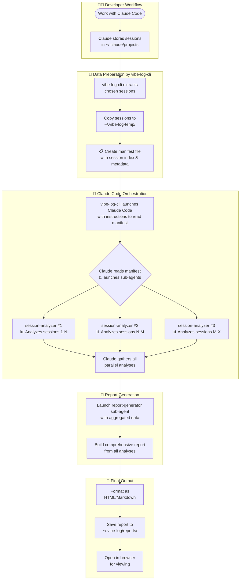

```mermaid
flowchart TD
    subgraph User ["🧑‍💻 Developer Workflow"]
        Start([Work with Claude Code]) --> Sessions[Claude stores sessions<br/>in ~/.claude/projects]
    end

    subgraph Preparation ["📁 Data Preparation by vibe-log-cli"]
        Sessions --> Extract[vibe-log-cli extracts<br/>chosen sessions]
        Extract --> TempFolder[Copy sessions to<br/>~/.vibe-log-temp/]
        TempFolder --> Manifest[📋 Create manifest file<br/>with session index & metadata]
    end

    subgraph Orchestration ["🎯 Claude Code Orchestration"]
        Manifest --> LaunchMain[vibe-log-cli launches Claude Code<br/>with instructions to read manifest]
        
        LaunchMain --> Orchestrator{Claude reads manifest<br/>& launches sub-agents}
        
        Orchestrator --> SA1[session-analyzer #1<br/>📊 Analyzes sessions 1-N]
        Orchestrator --> SA2[session-analyzer #2<br/>📊 Analyzes sessions N-M]
        Orchestrator --> SA3[session-analyzer #3<br/>📊 Analyzes sessions M-X]
        
        SA1 --> Gather[Claude gathers all<br/>parallel analyses]
        SA2 --> Gather
        SA3 --> Gather
    end

    subgraph Reporting ["📝 Report Generation"]
        Gather --> ReportGen[Launch report-generator sub-agent<br/>with aggregated data]
        ReportGen --> Build[Build comprehensive report<br/>from all analyses]
    end

    subgraph Output ["📄 Final Output"]
        Build --> Format[Format as<br/>HTML/Markdown]
        Format --> LocalReport[Save report to<br/>~/.vibe-log/reports/]
        LocalReport --> Open[Open in browser<br/>for viewing]
    end
```