# Local Report Generation Flow

## Overview
This document details how vibe-log generates reports locally using Claude Code and specialized sub-agents.

## Main Flow Diagram

```mermaid
flowchart TD
    subgraph User ["🧑‍💻 Developer Workflow"]
        Start([Chat with Claude Code]) --> Sessions[Claude stores sessions<br/>in ~/.claude/projects]
    end

    subgraph Selection ["📁 Session Selection"]
        Sessions --> Extract[vibe-log CLI extracts<br/>chosen sessions]
        Extract --> TempFolder[Copy sessions to<br/>~/.vibe-log-temp/]
    end

    subgraph Analysis ["🤖 Claude Code Analysis Engine"]
        TempFolder --> LaunchClaude[Launch Claude Code<br/>with specialized context]
        
        LaunchClaude --> Agents{Sub-agents analyze<br/>sessions in parallel}
        
        Agents --> A1[vibe-log-track-analyzer<br/>📊 Extract metrics]
        Agents --> A2[vibe-log-report-generator<br/>📝 Create reports]
        Agents --> A3[Additional sub-agents<br/>🔍 Deep analysis]
        
        A1 --> Combine[Combine all<br/>analysis results]
        A2 --> Combine
        A3 --> Combine
    end

    subgraph Output ["📄 Report Generation"]
        Combine --> Format[Format as<br/>HTML/Markdown]
        Format --> LocalReport[Save report to<br/>~/.vibe-log/reports/]
        LocalReport --> Open[Open in browser<br/>for viewing]
    end

    style User fill:#e1f5fe
    style Selection fill:#fff3e0
    style Analysis fill:#f3e5f5
    style Output fill:#e8f5e9
```



## Sub-agent Orchestration


## Data Privacy & Sanitization Flow

```mermaid
flowchart LR
    Raw[Raw Session Data] --> Sanitizer[Message Sanitizer v2]
    Sanitizer --> Redacted[Sanitized Data]
    
    subgraph Removed ["❌ Removed Before Analysis"]
        Code[Source Code]
        Secrets[API Keys/Tokens]
        Paths[System Paths]
        URLs[Private URLs]
        PII[Personal Info]
    end
    
    subgraph Preserved ["✅ Preserved for Analysis"]
        Patterns[Coding Patterns]
        Timing[Time Metrics]
        Commands[Commands Used]
        Errors[Error Types]
        Tools[Tools Referenced]
        Flow[Workflow Patterns]
    end
    
    Sanitizer -.->|Strips| Removed
    Sanitizer -->|Keeps| Preserved
    Preserved --> Redacted
```



## Detailed Process Steps

### 1. Session Storage
- Claude Code automatically saves all chat sessions
- Stored in `~/.claude/projects/[encoded-project-path]/`
- Format: JSONL (JSON Lines) with timestamped messages

### 2. Session Selection
- User runs `npx vibe-log-cli` 
- Interactive menu allows project/session selection
- Can select by date range or specific projects

### 3. Data Extraction
- Selected sessions copied to `~/.vibe-log-temp/`
- Original sessions remain untouched
- Temporary folder cleaned after analysis

### 4. Claude Code Launch
- New Claude Code instance spawned
- Loaded with specialized vibe-log context
- Sub-agents activated for parallel processing

### 5. Parallel Analysis
Multiple sub-agents work simultaneously:

| Sub-agent | Primary Function | Output Type |
|-----------|-----------------|-------------|
| **vibe-log-track-analyzer** | Extract quantitative metrics | JSON metrics |
| **vibe-log-report-generator** | Create formatted reports | HTML/Markdown |
| **vibe-log-content-creator** | Generate insights & summaries | Text content |
| **ai-productivity-researcher** | Analyze productivity patterns | Research data |
| **error-diagnosis-debugger** | Track error patterns | Error analysis |

### 6. Result Aggregation
- All sub-agent outputs collected
- Data merged and cross-referenced
- Duplicate information removed
- Final structure created

### 7. Report Generation
- HTML template populated with data
- Markdown version also generated
- Charts and visualizations created
- Saved to `~/.vibe-log/reports/[timestamp]/`

### 8. User Review
- Report automatically opens in default browser
- Interactive charts and filters available
- Export options for sharing

## File Structure

```
~/.vibe-log/
├── temp/                    # Temporary extraction folder
│   └── sessions/           # Copied session files
├── reports/                # Generated reports
│   └── 2024-01-29/        # Timestamped report folders
│       ├── index.html     # Main HTML report
│       ├── report.md      # Markdown version
│       └── data.json      # Raw analysis data
├── analyzed-prompts/       # Sub-agent analysis cache
└── hooks.log              # Hook execution logs
```

## Security & Privacy

1. **Local-Only Processing**: All analysis happens on user's machine
2. **No Network Calls**: Completely offline operation
3. **Sanitized Data**: Sensitive information removed before processing
4. **Temporary Files**: Cleaned up after analysis
5. **User Control**: Full control over what gets analyzed

## Performance Considerations

- Parallel sub-agent execution reduces total time
- Session chunking for large projects
- Incremental analysis support
- Cache previous analysis results
- Typical analysis: 2-5 minutes for week of sessions