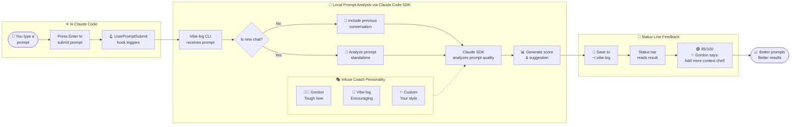

```mermaid
flowchart LR
    subgraph Input ["✳️ In Claude Code"]
        User([👤 You type a<br/>prompt]) --> Submit[Press Enter to<br/>submit prompt]
        Submit --> Hook[🪝 UserPromptSubmit<br/>hook triggers]
    end

    subgraph Analysis ["🧠 Local Prompt Analysis via Claude Code SDK"]
        Hook --> CLI[Vibe-log CLI<br/>receives prompt]
        CLI --> Check{Is new chat?}
        Check -->|No| Context[📝 Include previous<br/>conversation]
        Check -->|Yes| Direct[💭 Analyze prompt<br/>standalone]
        
        subgraph Personality ["🎭 Infuse Coach Personality"]
            Gordon[🧑‍🍳 Gordon<br/>Tough love]
            Vibe[💜 Vibe-log<br/>Encouraging]
            Custom[✨ Custom<br/>Your style]
        end
        
        Context --> SDK[Claude SDK<br/>analyzes prompt quality]
        Direct --> SDK
        Personality -.-> SDK
        SDK --> Score[📊 Generate score<br/>& suggestion]
    end

    subgraph Display ["💬 Status Line Feedback"]
        Score --> Save[💾 Save to<br/>~/.vibe-log]
        Save --> Status[Status bar<br/>reads result]
        Status --> Show[🟢 85/100<br/>✨ Gordon says:<br/>Add more context chef!]
    end

    Show --> Improve([📈 Better prompts<br/>Better results])
```